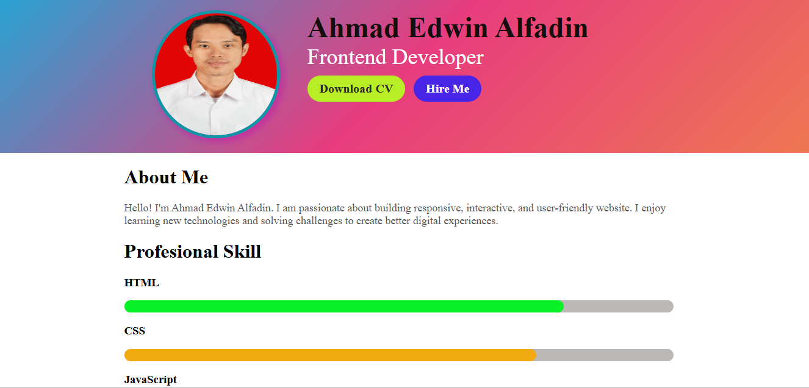

# 🌐 Live Demo

🔗 https://edwinalfadin.github.io/CSS-Mini-Project/

# 🌐 CSS Mini Project

A simple personal profile website built with HTML and CSS. This project demonstrates the fundamentals of web development, including page layout, styling, typography, and responsive design.

---

## 📖 About

This project is a mini portfolio/profile webpage that introduces the author's personal information, profile photo, skills, and contact details using only HTML and CSS.

---

## ✨ Features

- 👤 Personal profile section
- 🖼️ Profile photo
- 🎨 Modern and clean user interface
- 📱 Responsive layout
- ⚡ Lightweight and easy to customize

---

## 🛠️ Technologies Used

- HTML5
- CSS3

---

## 📂 Project Structure

text
CSS-MINI-PROJECT/
│── index.html
│── home.png
│── Pasfoto.jpg
│── README.md

---

## 🚀 Getting Started

1. Clone this repository:

bash
git clone https://github.com/EdwinAlfadin/CSS-Mini-Project.git

2. Open the project folder.

3. Open index.html in your browser or run it using *Live Server* in Visual Studio Code.

---

## 📸 Preview

---

## 👨‍💻 Author

*Ahmad Edwin Alfadin*

Front-End Developer

- GitHub: https://github.com/EdwinAlfadin
- LinkedIn: https://linkedin.com/in/ahmad-edwin-alfadin-alfa

---

## ⭐ Support

If you like this project, don't forget to give it a ⭐ on GitHub.

---

## 📄 License

This project is licensed under the MIT License.
